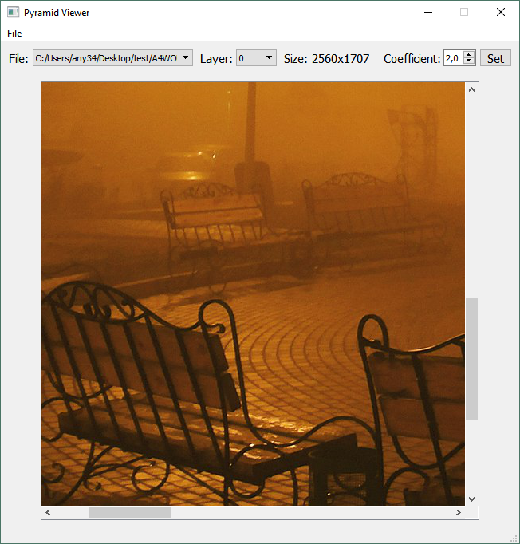
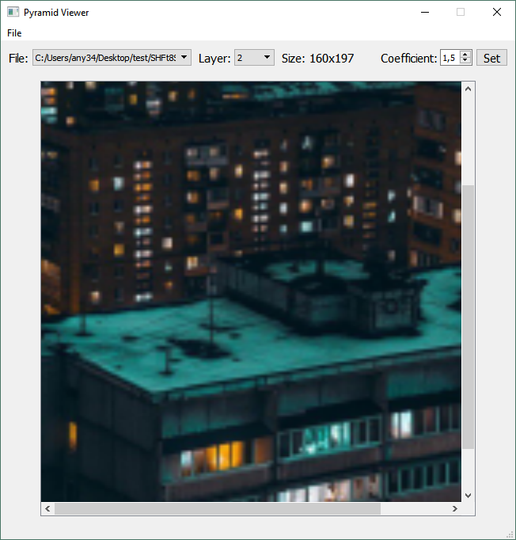

# Pyramid Viewer
Простая программа для просмотра построенной пирамиды изображений. 
Поддерживаются изображения формата JPEG и PNG. Возможно открытие нескольких файлов. Также возможно задать собственный коэффициент для построения пирамиды. 
Возможен запуск через командную строку. Формат запуска: "PyramidViewer.exe -путь до файла- -коэффициент-". 
# Примеры работы

  

  

